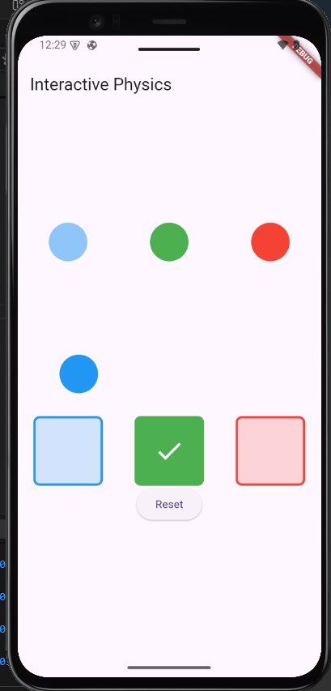

# Interactive Physics

A Flutter app demonstrating drag and drop interactions with colored objects.

## Features

- Drag colored circles (blue, green, red)
- Drop on matching colored targets
- Visual feedback with checkmark icons
- Reset functionality to start over

## How to Use

1. Drag the colored circles from the top row
2. Drop them on matching colored targets below
3. Successful matches show a checkmark icon
4. Use Reset button to clear all matches

Built with Flutter's `Draggable` and `DragTarget` widgets.
